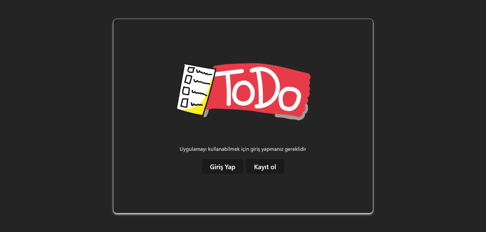

# Todo Uygulaması

React Vite, Firebase ve Redux Toolkit kullanarak geliştirilmiş bir todo uygulaması. Kullanıcılar üyelik oluşturup e-posta doğrulamasını tamamladıktan sonra kişisel veya herkese açık todolar ekleyebilirler.

## Özellikler

- **Kullanıcı Üyeliği ve Giriş**: Kullanıcılar Firebase Authentication ile üyelik oluşturabilir. Giriş sonrası mail adresini doğrulamaları gerekmektedir.
- **Todo Ekleme**:
  - **Kişisel Todo**: Sadece giriş yapan kullanıcıya ait olan todolar eklenebilir, düzenlenebilir ve silinebilir. Bu todolar diğer kullanıcılar tarafından görüntülenmez.
  - **Herkese Açık Todo**: Diğer kullanıcılar tarafından da görülebilen todolar eklenebilir. Ancak, bu todolar üzerinde yalnızca ekleyen kullanıcı düzenleme ve silme işlemi yapabilir.
- **Kullanıcı Bilgileri Güncelleme**: Giriş yapmış kullanıcı, sağ üstte bulunan ayarlar bölümünden profil bilgilerini ve şifresini güncelleyebilir.
- **Todo Sahip Bilgisi**: Herkese açık olarak eklenen todoların sahibinin isim bilgisi görüntülenir.
  
## Kullanılan Teknolojiler

- **React Vite**: Performanslı ve hızlı geliştirme deneyimi sunan Vite kullanılarak uygulama geliştirilmiştir.
- **Firebase**:
  - **Authentication**: Üyelik oluşturma, giriş, mail doğrulama, şifre güncelleme işlemlerini sağlamak için.
  - **Firestore**: Todo verilerini saklamak için.
  - **Storage**: Kullanıcı profil resimleri veya eklenmesi gereken diğer medya dosyalarını saklamak için.
- **Redux Toolkit**: Uygulama genelinde durumu yönetmek için kullanılmıştır.

## Kurulum

1. **Projeyi Klonlayın**:
   ```bash
   git clone https://github.com/cengo14/firebase-todo-app.git
   cd firebase-todo-app
   ```

2. **Gerekli Paketleri Kurun**:
   ```bash
   npm install
   ```

3. **Firebase Ayarlarını Yapın**:
   Firebase projesi oluşturup Authentication, Firestore ve Storage özelliklerini etkinleştirin. `src/firebase/index.js` dosyasına Firebase yapılandırma bilgilerinizi ekleyin.

4. **Çevresel Değişkenleri Ayarlayın**:
   Proje kök dizininde `.env` dosyası oluşturun ve Firebase yapılandırma bilgilerinizi buraya ekleyin:
   ```env
   VITE_FIREBASE_API_KEY=your_api_key
   VITE_FIREBASE_AUTH_DOMAIN=your_auth_domain
   VITE_FIREBASE_PROJECT_ID=your_project_id
   VITE_FIREBASE_STORAGE_BUCKET=your_storage_bucket
   VITE_FIREBASE_MESSAGING_SENDER_ID=your_messaging_sender_id
   VITE_FIREBASE_APP_ID=your_app_id
   ```

5. **Uygulamayı Başlatın**:
   ```bash
   npm run dev
   ```

## Kullanım

- **Üyelik ve E-posta Doğrulama**: Uygulamayı kullanmaya başlamak için üyelik oluşturun ve e-posta doğrulamasını tamamlayın.
- **Todo Ekleme**:
  - Kişisel olarak eklenen todolar sadece ekleyen kullanıcı tarafından görüntülenebilir, düzenlenebilir ve silinebilir.
  - Herkese açık eklenen todolar diğer kullanıcılar tarafından görüntülenebilir, ancak yalnızca ekleyen kullanıcı düzenleme veya silme yapabilir.
- **Ayarlar Bölümü**: Sağ üstteki ayarlar bölümünden profil bilgilerinizi veya şifrenizi güncelleyebilirsiniz.

## Ekran Görüntüleri




## Katkıda Bulunma

1. Bu repoyu fork edin.
2. Kendi branch'inizi oluşturun (`git checkout -b ozellik-adi`).
3. Yaptığınız değişiklikleri commit edin (`git commit -m 'Özellik ekle'`).
4. Branch'inizi push edin (`git push origin ozellik-adi`).
5. Bir Pull Request açın.

## Lisans

Bu proje MIT Lisansı ile lisanslanmıştır.

